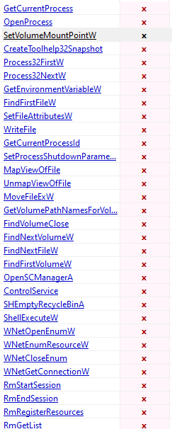
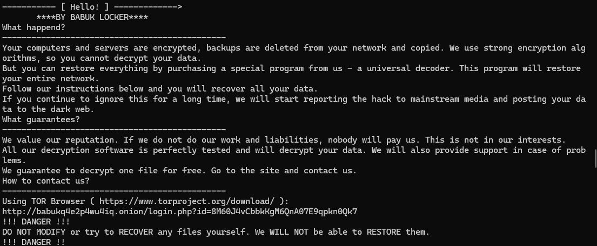
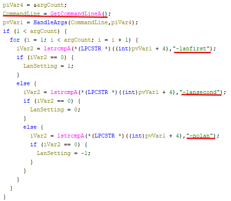
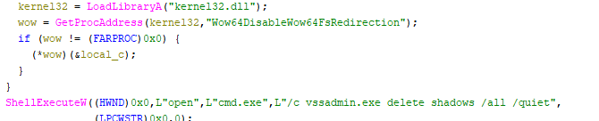
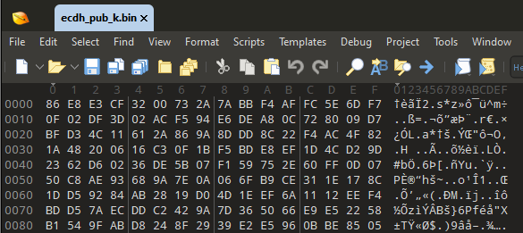

# Babuk - Ransomware

SHA256:  8203C2F00ECD3AE960CB3247A7D7BFB35E55C38939607C85DBDB5C92F0495FA9

Babuk is a well known ransomware as-a-service, having mostly targeted large enterprises and governments. 

## Quick PE analysis 
Opening the file in pestudio we can see a bunch of suspicious imports: 
  
The ones that really catch my eye are: **WriteFile, ShellExecuteW, WNetGetConnection** and **OpenSCManagerA**.

When executing strings on babuk.exe we see a bunch of familiar programs, e.g.: steam.exe, notepad.exe, excel.exe, etc. The malware might be looking for these processes to steal data or do something else.    
I also see a bunch of drive directories indicating it might look for/do something in the user's drives.  
Next to this we also see the names of popular browsers such as Chrome and Brave.  

We also see their README message to the victim:   

An interesting string I saw was `APPDATA`, the attacker might be searching for/spawning something in this folder.

## Opening Ghidra
The steps the malware takes: 

### 1. Argument resolving.  
The program sets what to do with lan networks according to what is used as arguments. It offers: 
- "lanfirst"
- "lansecond"
- "nolan"

### 2. Setting priority over other processes
The malware uses `SetProcessShutdownParameters(0,0)` to set its shutdown priority as low as possible, which could give the program more time to execute its code. 

### 3. Handles other services & processes
Using the service control manager it closes some services.   
It does the same for a list of processes: sql.exe, oracle.exe, outlook.exe and a bunch more windows system processes. It calls TerminateProcess() on every one of them.  
After some quick research I found out this is done to release file locks so the malware can gain access to the files. 

### 4. Removes snapshots & Recycle Bin
The malware then removes all snapshots taken of the OS so data resetting cant happen. It does this via a shellcommand: `vssadmin.exe delete shadows /all /quiet`. Next to this it also wipes the recycle bin. 

### 5. ecdh_pub_k.bin in APPDATA
At some point the malware creates a file called "ecdh_pub_k.bin" inside of the APPDATA folder. Since we're dealing with randsomeware this file could possibly contain de decryption keys *(ecdh_public_keys.bin ?)*. Or the combination of the attacker's keys + these public keys resort in file decryption. 

### 6. The encryption
The malware first scans for all available drives in the system. It will spawn 1 thread per drive which handles both the encryption of all the files and the creation of the README file. If there is a network drive detected it get its path by using WNetGetConnectionW.   
The files are all encrypted and get a **.__NIST_K571__** file extension.

## Some dynamic analysis
When we let the program run in a debugger we can see as soon as WriteFile is called that a new file spawns in APPDATA/Roaming. This is our earlier spotted ecdh_pub_k.bin. I suspect that these may be the decryption keys stored on our local machine. In total 144 bytes are written to this file.   
  
The suspected public key would be:
쿣2⩳뭺꿴廼ȏ㷟갂铵�ನ聲휉펿ᅌ⩡骆�⊌곴艏䠚ؠ쌖ᬏ뷵䰝鷒戣˖�ݛ姱⹵｠܍졐鎮驨੾漆캹ḱ谗픝蒒⢫퀙ṍ櫯ሑ햽식驂㙽晐堢咱ꮟⓘ⦏雥븋օ

However since there is a randomizer function the change is pretty big the encryption algorithm and the key both change every time its run.

