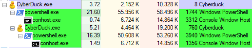

## Looking at the IAT
Looking at the IAT I immediately see some suspicious imports. 

- Registry edit (RegCreateKeyExW, RegDeleteKeyW, etc.)
- AdjustTokenPriveleges
- Encryption (DecryptFileW, CryptCreateHash, etc.)
- ShellExecuteExW
- WriteFile, DeleteFile
- CreateProcessW
- Internet (InternetOpenW, InternetConnectW)

