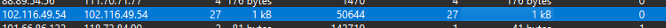

Kijkend naar de PCAP in Wireshark vallen me snel een paar dingen op. 563757 packets, maar gelukkig allemaal in IPv4.  
Om wat tijd te winnen bekijk ik gelijk de conversations in statistics.  

Om een beeld te krijgen van deze top 13 spelers sorteer ik de 
