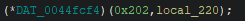
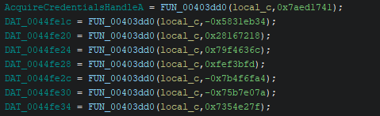
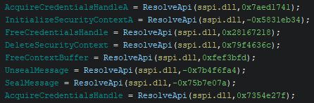

Upon opening

Set debug at RegSetvalueExA (kernel32.dll) and NtSetValueKey (ntdll.dll) to view where the malware is touching the registry. 

It hit a breakpoint on RegSetvalueExA. After executing until return I ended up in ws2_32.dll. After running until I ended up back in the malware's module, I saw that the following call was made by using pre determined addresses to functions like this in Ghidra:   
  
Going back into the debugger I saw that the call was made to the address of the `WSAStartup()` function. This function gives a pointer to a data structure that receives details of the Windows Sockets implementation.

Exiting that function call we see this WSA (Windows Subsystem for Android) address being used in a function which is labled as `getaddrinfo()` in x64dbg. Passed in as arguments are the pointer to the WSA and the following ip address: `37.77.150.277`.  
Letting this function execute we can see it's details of the ADDRINFOA structure given by the function in a memory dump.   
The ADDRINFOA is used by the getaddrinfo function to hold host address information.  

"37.77.150.227"

"Content-Type"
"application/octet-stream"
"X-Request-ID"

"Connection"
"close"
"Content-Length"
"121"
"User-Agent"
"Mozilla/5.0 (Windows NT 10.0; Win64; x64) AppleWebKit/537.36 (KHTML, like Gecko) Chrome/134.2.6187.130 Safari/537.36"
&"37.77.150.227"

"User-Agent"
"Mozilla/5.0 (Windows NT 10.0; Win64; x64) AppleWebKit/537.36 (KHTML, like Gecko) Chrome/134.2.6187.130 Safari/537.36"
"Content-Length"
"Connection"
"Host"
"close"
"X-Request-ID"

"Content-Type"
"application/octet-stream"
"Host"
"semrush.com"