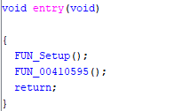
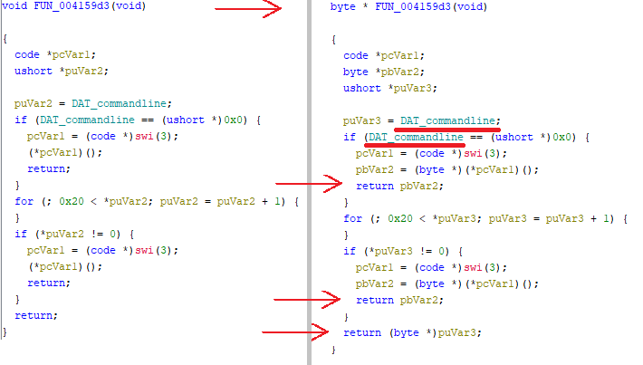
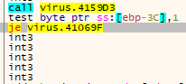
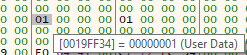
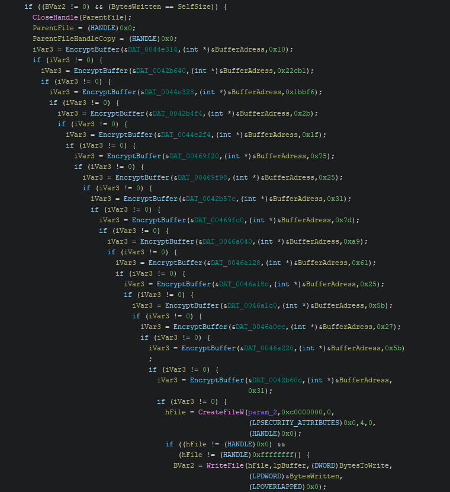

## Broken Loader

Made using Microsoft Visual C++ 8

Opening the file in pe studio I saw the following suspicious imports:  
CreateProcess, WriteFile, ShellExecuteW, RegCreateKeyExW, StartServiceW, CryptGenRandom. 

Looking at the entropy value in .data (7.683), .rsrc(7.716), .l2(7.702) there is a chance a part of this executable might be packed or obfuscated.   
Something that stands out is the existance of 2 .l2 sections, equal in size but different data. This is unusual and could also point to the usage of a packer. 

Strings: 

Big Base64 string referenced 3 times at offsets 7471c, 93724 and af724:  
`JJV13J3TqQNj94Pv069KwalF3iZvD98huf+ZImcAMNcVhuqUaLZSniHq14e8Wzmdov+/ZKud3b8HURR+IgxEIaPZXfeqyhpOzk+JgP1zvIejLgC5xxwUMiTuy+Z/FEKOnfF94TNxZyyS/iaxLy7JL+9U1YLNkjCd5/M2Vio5irLrJfp+zrRNBTxoJ7Mqx6+6QgdWwmJFrk0xAItTZSCaWwCN3p4tPUFj1oMhfws3mZeRnMM/+wg7Ykdlkbe4Mj1D2KjmSPNJRNlEZfJsbT3HFZMbkfDnfba3hj9Zf7ouUBUiYaIPAI9r3JNUjuCusWx+OhkCpg+tBWYl1rSRD4CWF94lDYPztgT3u8+52SaYwtn/APDlzsMXY3+ngEMwCQP6+hzY0Bvzv/nPr317ZqSdjban1hNZD5gx5XQw8vID/CoMegIiCIDn2D7H9r0wgXdPi7+rink0vRgza+fYmQO1QDe06/3JyAbQ7iUh+RdRPtLnXjJoFO+ptvLf34Pw0t/Q4ga8NDymh+QhXEQAPj+WYk3acoLs6LBIYCEcxJQmoHamn843EAz7DQ1QNYJzrVoWW9wNLDJFDuu1HYei895yWYbf/lp3K2ASPJVjSyBoeASMihBwor6xog/kRJDMhUaNEFWLaBLj54juuTpy+IxLxo+YxnanI80i8zJ11NP4o0A=`

## Ghidra: 

### Finding main 
Opening the file into ghidra I started looking for our main function. Writing off the first function as a compiler implemented setup function I went looking into the second one.  

In this second function there was a call GetCommandLineW(). I called the variable it's stored in DAT_commandline.  
When looking for the main function I always try to scan for function which accept arguments. I saw a function which had that, I looked at where the agrument was being set. The variable I was looking for was being set by the return of this function `(byte *)FUN_004159d3()`. 

Going into the function I saw it returned void. I did however see my earlier named DAT_commandline come back. That's when I knew this was where the arguments were handled. By editing the function signature to make it return a byte* I could see it's actual returning value.   

### Inside of main
When the program enters the main function I immediately see the CoInitialize() function call which tells that COM might be used.  
After a GetComputerNameA check we enter a bunch of checks which eventually lead to a CreateProcessW call. But let's backtrack a bit before looking into what that does.  

#### Anti-Debugging, in a debugger 
Ghidra shows a call to a function is being made right after the first computer name check. In this functions I see calls to OpenSCManagerW and OpenServiceW. It looks like the service name the function is trying to open is heavily obfuscated, but if that service runs it looks like it closes the application.  
Instead of trying to unravel the algorithm used, I will just load the application in a Debugger. 

## Debugger

### OpenServiceW
Opening the file into x32dbg, I set a breakpoint at the function I wanted to analyze (OpenServiceW). Just letting the debugger run wasn't an option however. The program would crash because of an access violation error. Looking at location it crashed at this test instruction is what's blocking our way. Its reading from a memory location stored in ebp -0x3c.  
  
Following ebp-0x3c in dump I see a single flipped bit.  
  
Patching the jump from je to jne made sure I could continue. 

Now executing till breakpoint does take me to OpenServiceW. Letting the algorithm do it's work I can see what value eventually gets passed into the function. This is `L"Schedule"`. "Schedule" is the process name for TaskScheduler, this means this program probably uses the handle to TaskScheduler to abuse persistence on the device.  
Looking at the flag set (0x11), this decomposes to x10 and x1 which are: SERVICE_START (0x0010) and SERVICE_QUERY_CONFIG (0x0001). The usage of these flags proves my suspicions more since this handler now has direct power to start services inside of the TaskScheduler. 

So my initial thought of this being another debugging check was wrong, this gave the malware direct access to the TaskScheduler. And by hiding it's intent (obfuscating the string), this would be harder to spot with static analysis or other anti-viruses.

### Temp file containing payload 
A bit before the program executes CreateProcessW a function is called which calls CreateFileW and WriteFile. The code contains a lot of jumps, comparisons and accessing runtime allocated memory. To find out what is written to this file, I thought i'd just let the program write it itself.  
The file is written to `C:\\Users\\malware\\AppData\\Local\\Temp\\AA60.tmp`. Opening this folder I saw that file. The first 2 bytes revealed what it was, MZ.. and the DOS stub told me that this file likely contains the actual payload.  
This file eventually gets referenced in CreateProcessW at the end of the program. It uses AA60.tmp as its filename and it uses this as the lpCommandLine arg: `"\"C:\\Users\\malware\\AppData\\Local\\Temp\\AA60.tmp\" --helpC:\\Users\\malware\\Downloads\\virus.exe\tB4E3DAFA432570384B4D064824F03AB68D5E16CE2201454D5620D5C5DECF0F8A27790FC02C5E6044394A22C5EDA08CEB7F5945E9B39485D0A7215CCAE1C6AC1E"`  
It seems like the .tmp file is loaded as a process. The long string after virus.exe could be used as a sha check to see if the original code has been altered or not.

### .tmp -> .exe
